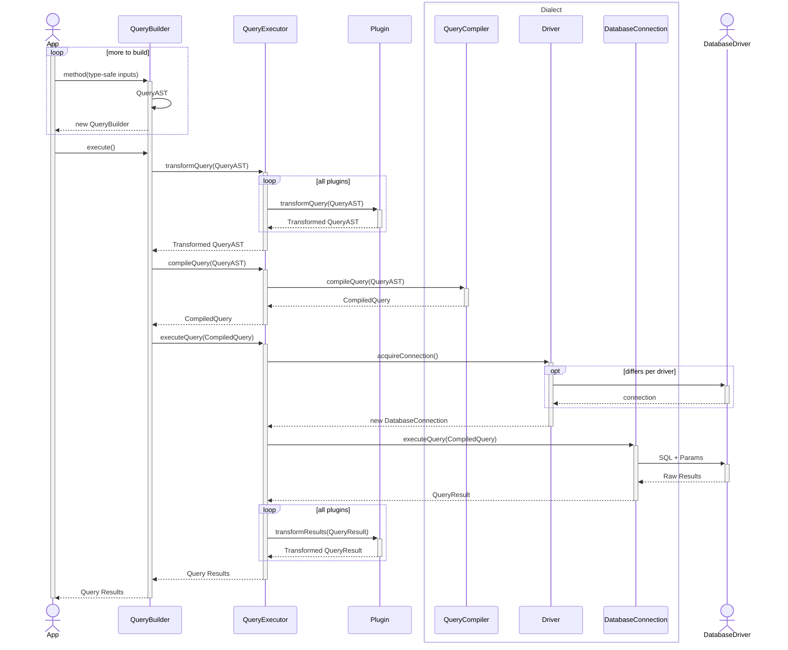

The following page gives a **simplified** overview of Kysely's execution flow, from query
building to querying the database. It is a nice introduction for anyone looking
to understand how Kysely works under the hood. Knowing what your dependencies do
and don't do is always a good idea!

This breakdown explains the journey from a type-safe method call in your application
to receiving results from the database, as depicted in the diagram.

1.  ### Immutable query building

    The process starts in your `App`. You interact with the `QueryBuilder` by calling
    its methods (`selectFrom`, `where`, etc.). Each call returns a _new_ `QueryBuilder`
    instance containing an updated, immutable `QueryAST` (Abstract Syntax Tree),
    which is the internal representation of your SQL query.

    ```mermaid
    sequenceDiagram
        actor Y as App
        participant QB as QueryBuilder

        activate Y

        loop more to build
            Y->>+QB: method(type-safe inputs)
            QB->>QB: QueryAST
            QB-->>Y: new QueryBuilder
        end

        deactivate QB
        deactivate Y
    ```

1.  ### Initiating execution

    When you chain the final `.execute()` call, the `QueryBuilder` begins a multi-step
    execution process, commanding the `QueryExecutor` to perform distinct tasks.

    ```mermaid
    sequenceDiagram
        autonumber 4

        actor Y as App
        participant QB as QueryBuilder

        activate Y

        Y->>+QB: execute()

        deactivate QB
        deactivate Y
    ```

1.  ### Query Transformation

    First, the `QueryBuilder` instructs the `QueryExecutor` to process the `QueryAST`.
    The `QueryExecutor` iterates through all registered plugins, calling `transformQuery`
    on each. This allows plugins to modify the query structure before compilation.
    The final, transformed `QueryAST` is returned to the `QueryBuilder`.

    ```mermaid
    sequenceDiagram
        autonumber 5

        participant QB as QueryBuilder
        participant QE as QueryExecutor
        participant P as Plugin

        activate QB

        QB->>+QE: transformQuery(QueryAST)

            loop all plugins
                QE->>+P: transformQuery(QueryAST)
                P-->>-QE: Transformed QueryAST
            end

        QE-->>-QB: Transformed QueryAST

        deactivate QB
    ```

1.  ### Query Compilation

    Next, the `QueryBuilder` tells the `QueryExecutor` to compile the transformed AST.
    The `QueryExecutor` delegates this to the `Dialect`-specific `QueryCompiler`.
    The compiler traverses the AST and produces a `CompiledQuery` object (containing
    the final SQL string and parameters). This `CompiledQuery` is then returned
    to the `QueryBuilder`.

    ```mermaid
    sequenceDiagram
        autonumber 9

        participant QB as QueryBuilder
        participant QE as QueryExecutor

        box Dialect
            participant QC as QueryCompiler
        end

        activate QB

        QB->>+QE: compileQuery(QueryAST)

            QE->>+QC: compileQuery(QueryAST)
            QC-->>-QE: CompiledQuery

        QE-->>-QB: CompiledQuery

        deactivate QB
    ```

1.  ### Execution & Connection Handling

    The `QueryBuilder` now asks the `QueryExecutor` to execute the `CompiledQuery`.
    - The `QueryExecutor` requests a connection from Kysely's `Driver`.
    - The `Driver`'s job is to abstract away vendor-specific details. It communicates
      with the actual third-party `DatabaseDriver` — for example, the `pg` or `mysql2`
      npm package — to get a connection from its pool.
    - A `DatabaseConnection` object, which wraps the native connection, is returned
      to the `QueryExecutor`.

    ```mermaid
    sequenceDiagram
        autonumber 13

        participant QB as QueryBuilder
        participant QE as QueryExecutor

        box Dialect
            participant D as Driver
        end

        actor DD as DatabaseDriver

        activate QB

        QB->>+QE: executeQuery(CompiledQuery)

            QE->>+D: acquireConnection()

                opt differs per driver
                    D->>+DD:
                    DD-->>-D: connection
                end

            D-->>-QE: new DatabaseConnection

        deactivate QE
        deactivate QB
    ```

1.  ### Database Query

    The `QueryExecutor` passes the `CompiledQuery` to the `DatabaseConnection` object,
    which executes it. The `DatabaseConnection` uses the underlying `DatabaseDriver`
    to send the SQL and parameters to the database for execution. The `DatabaseDriver`
    sends the raw results back. The `DatabaseConnection` standardizes these into
    a `QueryResult` object and returns it to the `QueryExecutor`. Immediately after,
    the connection is released back to the pool.

    ```mermaid
    sequenceDiagram
        autonumber 18

        participant QE as QueryExecutor

        box Dialect
            participant DC as DatabaseConnection
        end

        actor DD as DatabaseDriver

        activate QE

        QE->>+DC: executeQuery(CompiledQuery)

            DC->>+DD: SQL + Params
            DD-->>-DC: Raw Results

        DC-->>-QE: QueryResult

        deactivate QE
    ```

1.  ### Result Transformation

    The `QueryResult` is then passed through the plugin system again. The `QueryExecutor`
    calls the `transformResult` method on each plugin, allowing for final modifications
    to the results before they are returned to the `App`.

    ```mermaid
    sequenceDiagram
        autonumber 22

        participant QE as QueryExecutor
        participant P as Plugin

        activate QE

        loop all plugins
            QE->>+P: transformResults(QueryResult)
            P-->>-QE: Transformed QueryResult
        end

        deactivate QE
    ```

1.  ### Returning to the App

    The final, transformed `QueryResult` is passed up from the `QueryExecutor`
    to the `QueryBuilder`. The `QueryBuilder` then resolves the promise from the
    initial `.execute()` call, delivering the final, typed results to your `App`.


